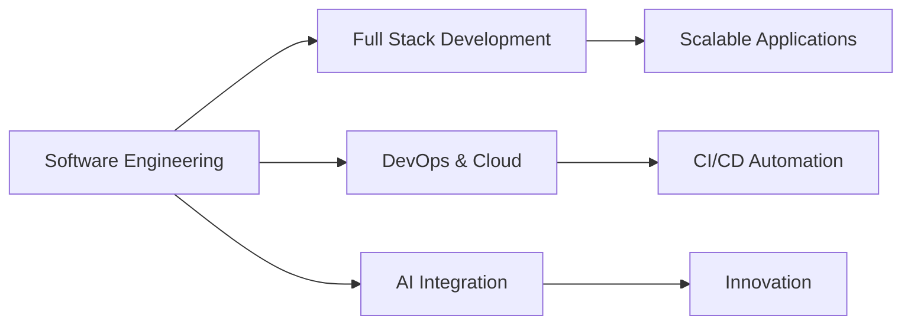

<div align="center">

# Nourel Houda Lassoued

### Software Engineer | Full Stack Developer | DevOps Engineer

[](https://nourelhoudalassoued.netlify.app/)
[](https://linkedin.com/in/nourelhouda-lassoued)
[](mailto:nourelhoudalassoued98@gmail.com)

</div>

---

## 🎓 Professional Summary

**Software Engineer** graduated from **ESPRIT** (2025) with expertise in designing and deploying enterprise-grade applications. Specialized in full-stack development, DevOps automation, and cloud-native architectures.

**Core Competencies:**
- Building scalable microservices architectures with **Spring Boot** and **Angular**
- Implementing **CI/CD pipelines** with Jenkins, Docker, and Kubernetes
- Infrastructure automation and container orchestration
- Monitoring and observability with **Prometheus**, **Grafana**, and ELK Stack
- Exploring **AI/ML** integration in production systems

---

## 💼 Technical Expertise

<table>
<tr>
<td width="50%" valign="top">

### Backend Development
```
- Spring Boot / Spring Cloud
- Node.js / Express.js
- .NET Core / C#
- Symfony / PHP
- RESTful & GraphQL APIs
- Microservices Architecture
```

### Frontend Development
```
- Angular / TypeScript
- React.js / Next.js
- HTML5 / CSS3 / SASS
- Bootstrap / Tailwind CSS
- Responsive Design
- State Management (Redux/NgRx)
```

### Databases & Storage
```
- MySQL / PostgreSQL
- MongoDB / Firebase
- Oracle Database
- Redis / Memcached
- Database Design & Optimization
```

</td>
<td width="50%" valign="top">

### DevOps & Cloud
```
- Docker / Kubernetes
- Jenkins / GitLab CI
- Azure DevOps / Azure Cloud
- Nginx / Load Balancing
- Infrastructure as Code
- Vagrant / Terraform
```

### Monitoring & Observability
```
- Prometheus / Grafana
- ELK Stack (Elasticsearch)
- Application Performance Monitoring
- Log Aggregation
- Metrics & Alerting
```

### Development Tools
```
- Git / GitHub / GitLab
- Postman / Swagger
- VS Code / IntelliJ IDEA
- Jira / Agile Methodology
- Unit & Integration Testing
```

</td>
</tr>
</table>

---

## 🛠️ Technology Stack

### Languages


### Frameworks & Libraries


### Databases


### DevOps & Cloud


### Monitoring & Tools


---

## 📊 GitHub Statistics

<div align="center">


</div>

---

## 🎯 Professional Focus


**Current Interests:**
- Microservices architecture patterns
- Kubernetes orchestration and service mesh
- Cloud-native application development
- Machine Learning operations (MLOps)
- Performance optimization and scalability

---

## 📫 Professional Contact

<div align="center">

| Channel | Link |
|---------|------|
| 🌐 **Portfolio** | [nourelhoudalassoued.netlify.app](https://nourelhoudalassoued.netlify.app/) |
| 📧 **Email** | [nourelhoudalassoued98@gmail.com](mailto:nourelhoudalassoued98@gmail.com) |
| 💼 **LinkedIn** | [Connect with me](https://linkedin.com/in/nourelhouda-lassoued) |

</div>

---

<div align="center">

### 🚀 Building robust, scalable, and maintainable solutions

*Open to collaboration on innovative projects and professional opportunities*


</div>
